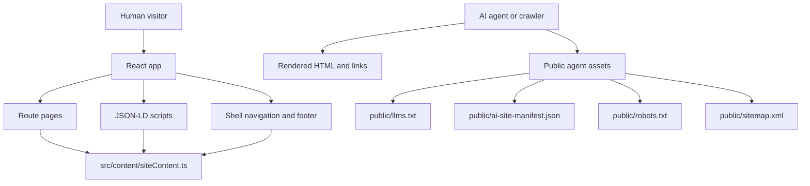
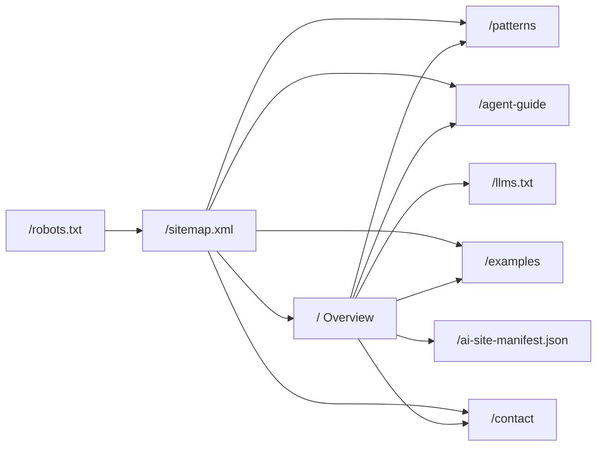
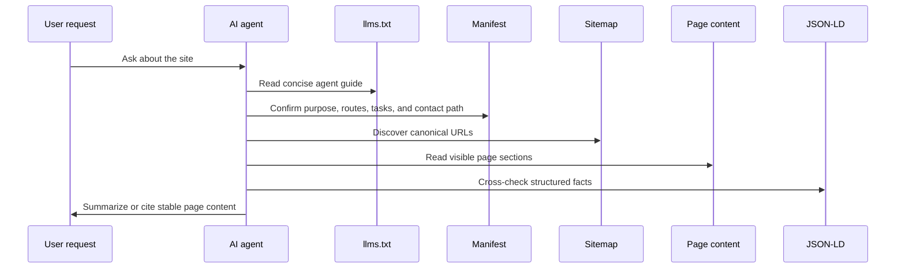
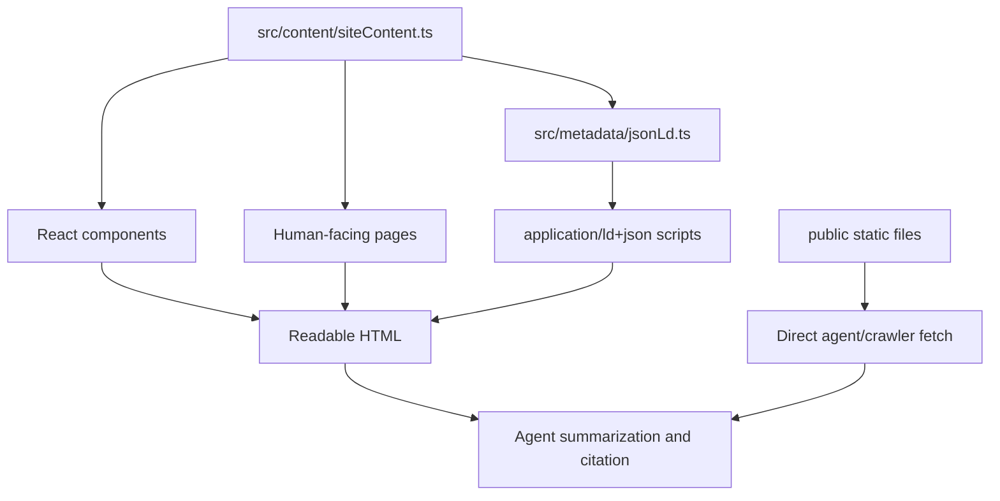

# AI-First Web Kit

AI-First Web Kit is a static Vite/React example website designed for two readers at once:

- humans who need clear pages, navigation, examples, and contact information
- AI agents and crawlers that need stable summaries, machine-readable files, structured metadata, canonical routes, and citation-friendly content

The site is intentionally small. Its main purpose is to show how an AI-first website fits together without needing a backend, account system, CMS, or runtime API.

## Quick Start

```powershell
npm install
npm run dev
```

The dev server runs on `http://127.0.0.1:5173` by default when Vite chooses the standard port.

Useful checks:

```powershell
npm run test
npm run build
npm run verify:agent-readability
```

## How The Website Fits Together



The central implementation idea is that visible UI and metadata should agree. Shared site facts live in `src/content/siteContent.ts`, and the React components plus JSON-LD builders read from that source where practical.

## Main Files

| Area | File or folder | Purpose |
| --- | --- | --- |
| App entry | `src/main.tsx` | Mounts the React app and global styles. |
| Routing | `src/App.tsx` | Selects the page from `window.location.pathname`, handles in-app navigation, and injects JSON-LD. |
| Shared facts | `src/content/siteContent.ts` | Defines the site name, canonical summary, routes, tasks, patterns, examples, FAQ, contact, and asset links. |
| Metadata | `src/metadata/jsonLd.ts` | Builds `WebSite`, `Organization`, `FAQPage`, and `HowTo` JSON-LD. |
| Layout | `src/components/Shell.tsx` | Provides crawlable navigation, footer summary, and the `llms.txt` link. |
| Pages | `src/pages/` | Human-facing routes: overview, patterns, agent guide, examples, contact, and not found. |
| Public assets | `public/` | Agent and crawler files served directly by Vite and copied into `dist/`. |
| Tests | `src/*.test.tsx`, `src/**/*.test.ts` | Content, metadata, route, style, static asset, and config checks. |

## Routes



Human-facing routes are normal pages with headings, links, and readable sections. Agent-facing files are in `public/`, so agents can fetch them directly without executing JavaScript.

## Why It Is AI First

This project treats AI access as a first-class interface, not as an SEO afterthought.



The AI-first contract is:

- A canonical summary is visible on the site and repeated in machine-readable assets.
- Important pages are reachable through plain anchor links.
- `/llms.txt` tells agents what the site is, which URLs matter, which tasks are expected, and how to cite content.
- `/ai-site-manifest.json` provides structured route, purpose, task, audience, update cadence, and contact data.
- `/robots.txt` points crawlers to `/sitemap.xml`.
- JSON-LD reinforces visible facts instead of inventing separate claims.
- Tests protect the contract so route lists, metadata, static assets, and content expectations do not drift silently.

## Content And Metadata Flow



The public files are static examples rather than generated output. When changing canonical facts such as the site URL, route list, contact email, or summary, update both the shared content module and the matching public assets.

## Verification

Run the automated checks before publishing changes:

```powershell
npm run test
npm run build
```

The test suite covers:

- route rendering and crawlable navigation
- shared content expectations
- JSON-LD structure
- public agent assets
- Vercel rewrite configuration
- important CSS constraints
- fallback HTML content for non-JavaScript or crawler contexts

After deployment, verify the public agent-readable files:

```powershell
npm run verify:agent-readability
```

To check a preview deployment or protected deployment, set the target URL and Vercel automation bypass secret first:

```powershell
$env:AGENT_READABILITY_BASE_URL="https://your-preview-deployment.vercel.app"
$env:VERCEL_AUTOMATION_BYPASS_SECRET="your-generated-secret"
npm run verify:agent-readability
```

The verifier sends `x-vercel-protection-bypass` when `VERCEL_AUTOMATION_BYPASS_SECRET` is present, then checks that `/llms.txt`, `/ai-site-manifest.json`, `/robots.txt`, and `/sitemap.xml` return the expected content types without `noindex`, `noai`, or `noimageai` directives.

## Deployment Notes

The site is static and can be deployed from the Vite `dist/` output.

`vercel.json` contains a rewrite so browser refreshes on client-side routes such as `/patterns` or `/agent-guide` still return `index.html`. Public files such as `/llms.txt`, `/robots.txt`, `/sitemap.xml`, and `/ai-site-manifest.json` remain directly fetchable.

`vercel.json` also pins response headers for the machine-readable files. Vercel Firewall managed rulesets are project dashboard/API state, so keep Bot Protection and AI Bots managed rulesets in `log` mode or add bypass rules for these paths when indexing by legitimate AI agents is desired.
