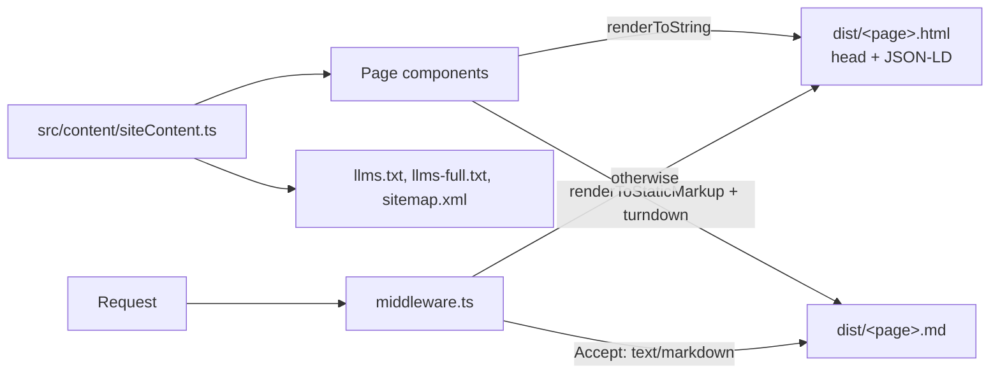

# AI-First Web Kit

A small static website that shows what makes a website AI native in 2026, and applies each pattern to itself. Live at <https://ai-first-web-kit.vercel.app>.

"AI native" here means four things, each checked by tests or audits:

| Layer | What it means | How this site does it |
| --- | --- | --- |
| Readable | An agent can understand every page from its HTML alone. | Every route is prerendered with its own title, canonical and JSON-LD. Unknown URLs return 404; moved URLs redirect with 308. |
| Fetchable | An agent can get the content cheaply. | Every page has a Markdown version at `/<page>.md`, also served at the page URL when a request sends `Accept: text/markdown`. `llms.txt`, `llms-full.txt` and the sitemap are generated. |
| Operable | An agent can take actions, and people confirm anything with consequences. | The pattern search and the contact form are declarative WebMCP tools. Search submits itself; the contact form only drafts a GitHub issue that a person submits. |
| Measurable | The claims are checked. | Lighthouse's Agentic Browsing category and a verifier run against the site, and the results are published on `/evidence`. |

The site's own `/patterns` page explains each pattern, the 2025-era patterns this site retired (a custom AI manifest, "Agent Tasks" copy addressed to agents, a client-only SPA), and standards it is watching but not adopting yet (ARD catalogs, imperative WebMCP, agent payments).

## Quick start

```sh
npm install
npm run dev        # http://127.0.0.1:5173
npm test
npm run build      # writes dist/
npm run preview    # serves dist/ with production routing, http://127.0.0.1:4173
```

## How it fits together


```mermaid
flowchart LR
  content[src/content/siteContent.ts] --> pages[Page components]
  pages -->|renderToString| html["dist/&lt;page&gt;.html<br/>head + JSON-LD"]
  pages -->|renderToStaticMarkup + turndown| md["dist/&lt;page&gt;.md"]
  content --> files[llms.txt, llms-full.txt, sitemap.xml]
  request[Request] --> mw[middleware.ts]
  mw -->|Accept: text/markdown| md
  mw -->|otherwise| html
```

- **One source of truth.** `src/content/siteContent.ts` holds the routes, patterns, FAQ and WebMCP tool definitions. Pages, head tags, JSON-LD, Markdown, `llms.txt` and the sitemap are all built from it, so they can't disagree.
- **Prerendering.** `npm run build` runs the client build, an SSR build of `src/entry-server.tsx`, then `scripts/prerender.mjs`, which writes one HTML file and one Markdown file per route, plus `404.html` and the generated text files. The browser hydrates each page; there is no client-side router.
- **Markdown negotiation.** `middleware.ts` is Vercel Routing Middleware. When a request prefers `text/markdown` it rewrites to the `.md` file; every page response carries `Vary: Accept`, and Markdown responses carry a canonical `Link` header. It is middleware rather than a `vercel.json` rewrite because Vercel checks the filesystem before rewrites, so a rewrite never fires for a path that has a prerendered file.
- **WebMCP.** `src/components/PatternSearch.tsx` and `src/components/ContactForm.tsx` add `toolname`, `tooldescription` and `toolparamdescription` to ordinary forms. Search answers agent calls through `SubmitEvent.respondWith`.

## Main files

| Path | Purpose |
| --- | --- |
| `src/content/siteContent.ts` | Routes, patterns, FAQ, WebMCP tool definitions. |
| `src/entry-server.tsx`, `scripts/prerender.mjs` | Build-time rendering of HTML, Markdown and generated files. |
| `src/metadata/head.ts`, `src/metadata/jsonLd.ts` | Per-route head tags and JSON-LD graph. |
| `src/agent/` | Markdown conversion, Accept-header negotiation, `llms.txt` and sitemap generators. |
| `middleware.ts` | Markdown content negotiation on Vercel. |
| `vite.config.ts` | Includes a preview-only plugin that applies the same middleware, redirects and 404 handling, so `npm run preview` behaves like production. |
| `vercel.json` | Clean URLs, redirects for retired routes, content types. |
| `scripts/verify-agent-readability.mjs` | Fetches a deployment as browsers and agents do and checks the contract. |
| `scripts/audit-agentic.mjs` | Runs Lighthouse Agentic Browsing plus the verifier and writes `src/content/evidence.json`. |

## Verification

Tests cover rendering of every route, JSON-LD, Markdown output, generated files, content negotiation, the middleware, the WebMCP forms (including an agent-invoked submit), and an axe-core accessibility pass over every page.

The verifier discovers pages through `robots.txt` and the sitemap, then checks each one: HTML status, a single `h1`, self-referencing canonical, unique title, JSON-LD in the server HTML, `Vary: Accept`, Markdown by negotiation and by `.md` URL, plus `llms.txt` links, a real 404 and the 308 redirects.

```sh
npm run build && npm run preview &
AGENT_READABILITY_BASE_URL=http://127.0.0.1:4173 npm run verify:agent-readability

# against a deployment (set VERCEL_AUTOMATION_BYPASS_SECRET for protected previews)
AGENT_READABILITY_BASE_URL=https://ai-first-web-kit.vercel.app npm run verify:agent-readability
```

CI (`.github/workflows/ci.yml`) runs the tests, the build, and the verifier against `vite preview`.

### Refreshing the evidence page

```sh
AUDIT_BASE_URL=https://ai-first-web-kit.vercel.app CHROME_PATH=/path/to/chrome npm run audit:agentic
```

This needs a Chrome that supports WebMCP (146 or later). The script turns it on with `--enable-features=WebMCPTesting`; on older Chrome the three WebMCP audits report "not applicable". Commit the updated `src/content/evidence.json`.

## Deployment notes

- To expose the WebMCP tools to visitors' Chrome without a flag, register for the WebMCP origin trial and set the token as `VITE_WEBMCP_OT_TOKEN` in the Vercel project. The forms work normally without it.
- Keep Vercel's Bot Protection and AI Bots managed rulesets in log mode, or add bypass rules, if you want AI agents to be able to fetch the site.
